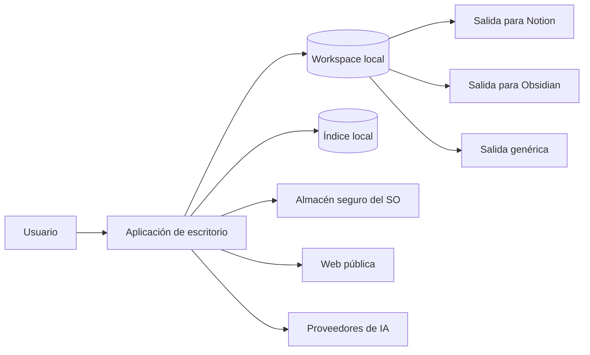
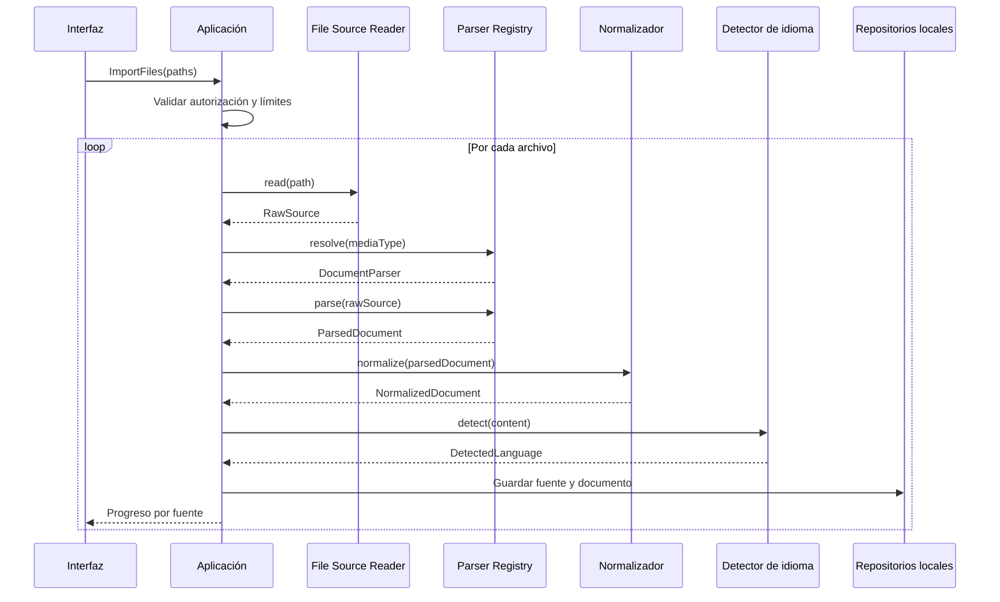
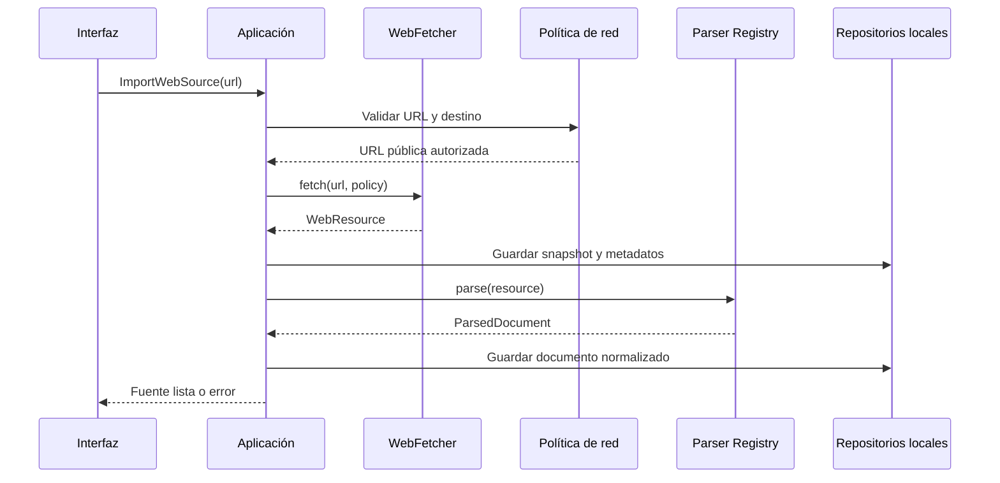
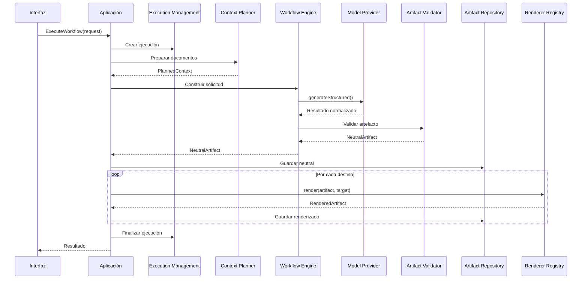
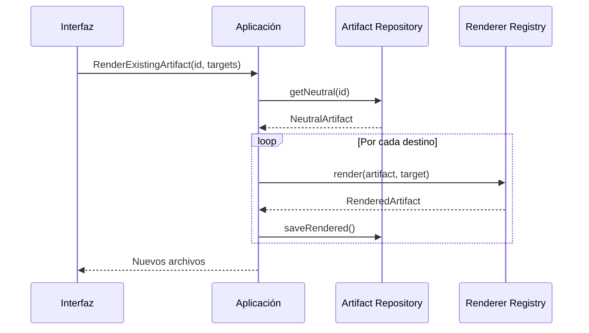

# Arquitectura del sistema

- **Proyecto:** Knowledge Workflow Engine
- **Documento:** Arquitectura del MVP
- **Estado:** Accepted
- **Versión:** 1.0
- **Fecha:** 2026-07-24
- **Documento rector relacionado:** [`project-scope.md`](project-scope.md)

## 1. Propósito

Este documento define la arquitectura del MVP de Knowledge Workflow Engine.

Establece:

- el estilo arquitectónico;
- los límites del sistema;
- los módulos y sus responsabilidades;
- las dependencias permitidas;
- los procesos de ejecución;
- los contratos principales;
- el modelo de persistencia local;
- las reglas de seguridad;
- los flujos técnicos de extremo a extremo;
- las decisiones que deberán respetar la implementación y las herramientas de inteligencia artificial.

Este documento no selecciona librerías concretas. Las tecnologías se definirán en [`tech-stack.md`](tech-stack.md) después de aprobar esta arquitectura.

## 2. Autoridad y precedencia

La documentación tendrá la siguiente precedencia:

1. [`project-scope.md`](project-scope.md) define qué pertenece al MVP.
2. `architecture.md` define cómo se divide el sistema y qué dependencias están permitidas.
3. [`tech-stack.md`](tech-stack.md) seleccionará tecnologías compatibles con esta arquitectura.
4. [`implementation-plan.md`](implementation-plan.md) establecerá el orden de construcción.
5. [`AGENTS.md`](../AGENTS.md) convertirá estas decisiones en reglas operativas.
6. Los ADR registrarán decisiones arquitectónicas posteriores.

Una tecnología o implementación no podrá contradecir el alcance ni las fronteras definidas aquí.

## 3. Drivers arquitectónicos

La arquitectura debe responder a los siguientes drivers:

### 3.1 Agnosticidad del gestor de notas

Notion y Obsidian son destinos de renderizado. No forman parte del dominio ni de la definición de los workflows.

Agregar un nuevo destino deberá requerir un nuevo renderizador, no cambios en:

- los parsers;
- el modelo documental normalizado;
- los workflows;
- los proveedores de inteligencia artificial;
- los artefactos neutrales existentes.

### 3.2 Agnosticidad del proveedor de inteligencia artificial

Los workflows dependerán de un contrato común de generación, no de SDK, API o modelo específico.

Agregar un proveedor deberá requerir un adaptador y sus pruebas de contrato.

### 3.3 Múltiples formatos de entrada

Los workflows consumirán documentos normalizados. No recibirán directamente PDF, DOCX, PPTX, HTML u otros archivos.

Agregar un nuevo formato deberá requerir un parser o lector compatible, sin modificar la lógica del workflow.

### 3.4 Local-first y portabilidad

El proyecto, las fuentes, los documentos normalizados, las ejecuciones y los artefactos permanecerán en un workspace local portable.

Los índices operativos deberán poder reconstruirse a partir del workspace.

### 3.5 Artefactos neutrales

El resultado del modelo deberá convertirse en un artefacto neutral validado antes de generar salidas para Notion, Obsidian o formatos genéricos.

### 3.6 Interfaz responsiva

La extracción, descarga, procesamiento con IA y renderizado no deberán bloquear el proceso responsable de la interfaz.

### 3.7 Trazabilidad y reproducibilidad

Cada artefacto deberá relacionarse con:

- fuentes;
- workflow y versión;
- ejecución;
- proveedor y modelo;
- idioma de salida;
- renderizador y versión.

### 3.8 Seguridad de contenido no confiable

Los archivos y las páginas web serán tratados como entradas no confiables.

El sistema no ejecutará código, macros ni contenido activo proveniente de las fuentes.

## 4. Estilo arquitectónico

El MVP se implementará como un **monolito modular local-first**, organizado mediante **arquitectura hexagonal**, también conocida como Ports and Adapters.

### 4.1 Monolito modular

El sistema se distribuirá como una sola aplicación de escritorio, pero internamente estará dividido en módulos con contratos explícitos.

No se utilizarán microservicios.

Razones:

- el MVP será usado inicialmente por un solo usuario;
- el almacenamiento y la ejecución serán locales;
- no existe necesidad de despliegue independiente por capacidad;
- reduce complejidad operativa;
- permite transacciones y trazabilidad locales;
- facilita construir slices verticales funcionales.

### 4.2 Arquitectura hexagonal

El dominio y los casos de uso se ubicarán en el centro.

Las integraciones se conectarán mediante puertos:

- sistema de archivos;
- parsers;
- proveedores de IA;
- almacenamiento local;
- descarga web;
- renderizadores;
- almacenamiento de secretos;
- interfaz de escritorio.

La dirección de dependencias siempre apuntará hacia el núcleo.

```text
Presentation → Application → Domain
Infrastructure → Application ports
Infrastructure → Domain contracts
Domain → nothing external
```

### 4.3 Procesamiento orientado a tareas

Las operaciones de larga duración se modelarán como ejecuciones rastreables y cancelables.

No se implementará event sourcing.

Podrán utilizarse eventos internos para desacoplar actualizaciones de estado, logs y refresco de interfaz, pero el estado oficial continuará almacenándose mediante repositorios locales.

## 5. Contexto del sistema



### 5.1 Actores y sistemas externos

| Actor o sistema | Responsabilidad |
|---|---|
| Usuario | Configura proyectos, fuentes, workflows, modelos, idiomas y destinos |
| Sistema de archivos | Proporciona fuentes y almacena el workspace |
| Web pública | Proporciona páginas HTML o archivos públicos |
| Proveedor de IA | Ejecuta generación de contenido |
| Almacén seguro del sistema operativo | Protege credenciales |
| Notion | Destino de archivos preparados; no existe integración remota en el MVP |
| Obsidian | Consumidor de Markdown y JSON Canvas generados |

## 6. Topología de ejecución de escritorio

La aplicación tendrá tres zonas de ejecución conceptuales.

La tecnología concreta para implementarlas se seleccionará en `tech-stack.md`.

### 6.1 Proceso de interfaz

Responsable de:

- renderizar la experiencia de usuario;
- administrar estado efímero de pantalla;
- capturar drag-and-drop;
- mostrar progreso, logs y resultados;
- solicitar operaciones mediante una API interna restringida.

No tendrá acceso directo a:

- credenciales;
- escritura arbitraria en el sistema de archivos;
- SDK de proveedores;
- parsers nativos;
- base de datos local;
- red sin mediación.

### 6.2 Host de aplicación

Responsable de:

- exponer una API interna segura a la interfaz;
- ejecutar casos de uso;
- validar comandos;
- coordinar repositorios y adaptadores;
- administrar proyectos;
- controlar ejecuciones y cancelación;
- autorizar rutas;
- emitir eventos de progreso.

### 6.3 Workers de procesamiento

Responsables de operaciones costosas o potencialmente bloqueantes:

- extracción de PDF;
- extracción de DOCX y PPTX;
- parsing de archivos grandes;
- normalización;
- detección de idioma;
- cálculo de tamaños y límites;
- transformación de artefactos grandes.

Los workers no definirán reglas de negocio.

Deberán recibir comandos serializables y devolver resultados o errores normalizados.

### 6.4 Sistemas externos

Las llamadas a proveedores de IA y fuentes web se realizarán desde adaptadores controlados por el host de aplicación.

La interfaz no invocará servicios externos directamente.

## 7. Capas

## 7.1 Dominio

Contendrá conceptos y reglas independientes de frameworks.

Responsabilidades:

- identidad y estado de proyectos;
- fuentes y referencias;
- documentos normalizados;
- workflows y versiones;
- ejecuciones y transiciones válidas;
- artefactos neutrales;
- grafos de conocimiento;
- destinos de renderizado;
- errores de dominio;
- invariantes y políticas.

El dominio no podrá importar:

- frameworks de interfaz;
- SDK de proveedores;
- librerías de parsing;
- drivers de base de datos;
- APIs del sistema operativo;
- clientes HTTP;
- herramientas específicas de Notion u Obsidian.

## 7.2 Aplicación

Contendrá casos de uso y coordinación.

Responsabilidades:

- crear y abrir proyectos;
- importar fuentes;
- extraer y normalizar documentos;
- detectar idiomas;
- planificar contexto;
- ejecutar workflows;
- validar artefactos;
- renderizar artefactos;
- consultar historial;
- cancelar ejecuciones;
- coordinar persistencia;
- publicar progreso.

La capa de aplicación dependerá del dominio y de contratos abstractos.

No contendrá detalles de SDK, filesystem, base de datos o interfaz.

## 7.3 Infraestructura

Implementará los puertos definidos por el núcleo.

Incluye:

- filesystem;
- almacenamiento de metadatos;
- parsers;
- detector de idioma;
- cliente web;
- adaptadores de proveedores;
- renderizadores;
- secret store;
- logging;
- reloj e identificadores concretos;
- empaquetado e integración con el sistema operativo.

## 7.4 Presentación

Contendrá:

- componentes visuales;
- estado de navegación;
- formularios;
- validación de entrada de usuario;
- comandos de interfaz;
- proyecciones de progreso;
- vista previa de artefactos.

La presentación solo se comunicará con la aplicación mediante una API interna tipada.

## 8. Módulos del monolito

## 8.1 Project Management

Responsable del ciclo de vida de proyectos locales.

Casos de uso:

- `CreateProject`;
- `OpenProject`;
- `ListRecentProjects`;
- `ValidateProjectWorkspace`;
- `RepairProjectIndex`.

Reglas:

- cada proyecto tendrá un identificador estable;
- la estructura se creará de forma determinista;
- abrir un proyecto no deberá modificarlo silenciosamente;
- las migraciones deberán ser versionadas.

## 8.2 Source Ingestion

Responsable de incorporar fuentes.

Casos de uso:

- `ImportFiles`;
- `ImportFolder`;
- `ImportPastedText`;
- `ImportWebSource`;
- `RemoveSource`;
- `RetrySourceExtraction`.

Distinguirá entre:

- referencia original;
- snapshot local;
- metadatos;
- estado de incorporación.

No interpretará semánticamente el contenido.

## 8.3 Document Processing

Responsable de convertir fuentes en documentos normalizados.

Componentes:

- resolución de tipo MIME;
- selección de parser;
- extracción;
- limpieza controlada;
- normalización estructural;
- detección de extracción vacía;
- advertencias;
- cálculo de estadísticas.

Regla principal:

```text
RawSource → Parser → ParsedContent → NormalizedDocument
```

Los workflows solo recibirán `NormalizedDocument`.

## 8.4 Language

Responsable de:

- detectar idioma predominante;
- registrar confianza cuando esté disponible;
- validar el idioma solicitado;
- resolver nombres y códigos normalizados;
- preservar la diferencia entre idioma de fuente, interfaz y salida.

No realizará por sí mismo la traducción del documento.

## 8.5 Workflow Engine

Responsable de:

- registrar definiciones de workflow;
- cargar una versión;
- validar parámetros;
- construir instrucciones;
- invocar el puerto de modelos;
- validar la respuesta;
- producir un artefacto neutral.

Workflows permitidos en el MVP:

- `summary`;
- `knowledge-map`.

El motor no conocerá destinos como Notion u Obsidian.

## 8.6 Context Planning

Responsable de preparar documentos para el modelo.

Funciones:

- medir contenido;
- aplicar límites configurados;
- ordenar fuentes;
- segmentar por secciones cuando sea necesario;
- decidir si una ejecución puede procesarse directamente;
- rechazar contenido que exceda límites no manejables;
- consolidar resultados parciales mediante una estrategia determinista.

El MVP no utilizará:

- búsqueda vectorial;
- embeddings;
- RAG;
- selección semántica global.

La segmentación no deberá cambiar silenciosamente el significado del workflow.

## 8.7 Model Gateway

Responsable de abstraer proveedores de inteligencia artificial.

Funciones:

- seleccionar proveedor y modelo;
- consultar capacidades;
- ejecutar solicitudes;
- normalizar respuestas;
- mapear errores;
- reportar uso cuando esté disponible;
- soportar cancelación y timeout;
- evitar exposición de secretos.

El gateway no decidirá la estructura del resumen o del grafo. Esa responsabilidad pertenece al workflow.

## 8.8 Artifact Management

Responsable de:

- validar artefactos neutrales;
- asignar identidad y versión;
- persistirlos;
- relacionarlos con la ejecución;
- recuperarlos;
- permitir renderizado posterior sin nueva generación.

Tipos iniciales:

- `StudySummary`;
- `KnowledgeGraph`.

## 8.9 Rendering

Responsable de convertir artefactos neutrales en archivos específicos.

Renderizadores iniciales:

- `GenericMarkdownRenderer`;
- `GenericJsonRenderer`;
- `MermaidRenderer`;
- `NotionMarkdownRenderer`;
- `ObsidianMarkdownRenderer`;
- `JsonCanvasRenderer`.

Un renderizador:

- recibe un artefacto neutral validado;
- no llama al modelo;
- no modifica la fuente;
- no modifica el artefacto neutral;
- devuelve uno o varios archivos renderizados y su manifiesto.

## 8.10 Execution Management

Responsable de:

- crear ejecuciones;
- controlar estados;
- registrar progreso;
- aislar fallos por fuente;
- coordinar cancelación;
- registrar errores;
- finalizar con estado coherente;
- consultar historial.

No se permitirá modificar retroactivamente una ejecución finalizada.

Una nueva renderización se registrará como una operación relacionada con el artefacto existente.

## 8.11 Settings and Secrets

Responsable de:

- preferencias locales;
- proveedor predeterminado;
- idioma de interfaz;
- idiomas de salida recientes;
- límites de procesamiento;
- referencias a credenciales protegidas.

Los secretos no se guardarán en:

- `project.json`;
- manifiestos;
- logs;
- base de datos sin protección;
- archivos de workflow;
- artefactos.

## 9. Modelo de dominio principal

## 9.1 Project

Representa un workspace local.

Atributos mínimos:

- `ProjectId`;
- nombre;
- versión de esquema;
- ruta autorizada;
- fecha de creación;
- fecha de modificación;
- configuración no sensible.

Invariantes:

- el identificador no cambia;
- la ruta debe ser absoluta y autorizada;
- la versión del esquema debe ser compatible o migrable.

## 9.2 Source

Representa una entrada incorporada al proyecto.

Tipos:

- `file`;
- `web`;
- `pasted-text`.

Atributos mínimos:

- `SourceId`;
- tipo;
- referencia original;
- snapshot local;
- nombre o título;
- tipo MIME;
- tamaño;
- hash cuando corresponda;
- estado;
- error o advertencias;
- fecha de incorporación.

## 9.3 NormalizedDocument

Representa contenido listo para workflows.

Atributos mínimos:

- `DocumentId`;
- `SourceId`;
- título;
- contenido;
- secciones;
- metadatos;
- idioma detectado;
- confianza opcional;
- estadísticas;
- advertencias;
- versión del normalizador.

El contenido normalizado deberá ser serializable.

## 9.4 WorkflowDefinition

Representa una definición versionada.

Atributos mínimos:

- identificador;
- versión;
- nombre;
- descripción;
- tipos de entrada aceptados;
- parámetros;
- plantilla de instrucciones;
- esquema de salida;
- política de contexto;
- tipos de artefacto producidos.

No contendrá:

- API keys;
- rutas de usuario;
- nombres obligatorios de proveedor;
- instrucciones para guardar en Notion u Obsidian;
- acceso directo a archivos.

## 9.5 Execution

Representa una ejecución rastreable.

Atributos mínimos:

- `ExecutionId`;
- proyecto;
- workflow y versión;
- fuentes;
- documentos normalizados;
- idioma de salida;
- proveedor y modelo;
- destinos;
- estado;
- tiempos;
- progreso;
- errores;
- artefactos.

## 9.6 NeutralArtifact

Base común para resultados neutrales.

Atributos mínimos:

- `ArtifactId`;
- tipo;
- versión de esquema;
- título;
- idioma;
- referencias a fuentes;
- `ExecutionId`;
- fecha de generación;
- payload validado;
- hash de contenido.

## 9.7 StudySummary

Contenido estructurado mínimo:

- título;
- resumen ejecutivo;
- secciones;
- conceptos;
- preguntas y respuestas cuando existan;
- referencia técnica cuando corresponda;
- glosario cuando corresponda;
- metadatos.

La especificación final se definirá en el schema versionado del workflow.

## 9.8 KnowledgeGraph

Contenido estructurado mínimo:

- título;
- nodos;
- relaciones;
- etiquetas;
- referencias a fuentes;
- metadatos.

Cada nodo y relación tendrá identificadores estables dentro del artefacto.

Las coordenadas visuales no son parte obligatoria del grafo neutral.

## 9.9 RenderedArtifact

Representa uno o varios archivos producidos por un renderizador.

Atributos mínimos:

- `RenderedArtifactId`;
- `ArtifactId`;
- renderizador y versión;
- destino;
- archivos;
- ruta relativa;
- hash;
- fecha;
- advertencias.

## 10. Estados

## 10.1 Estado de una fuente

```text
pending
  → copying | fetching
  → extracting
  → normalizing
  → ready
```

Estados terminales alternativos:

```text
unsupported
failed
removed
```

Una fuente `ready` deberá tener un documento normalizado válido.

## 10.2 Estado de una ejecución

```text
pending
  → preparing
  → processing
  → validating
  → rendering
  → completed
```

Estados terminales alternativos:

```text
completed_with_errors
failed
cancelled
```

Reglas:

- `completed` requiere artefacto neutral válido y renderizados solicitados exitosos;
- `completed_with_errors` permite fallos parciales documentados;
- `failed` no podrá presentar artefactos incompletos como válidos;
- `cancelled` deberá conservar el registro de operaciones ya realizadas;
- los estados terminales son inmutables.

Los nombres públicos definitivos deberán mantenerse consistentes con `project-scope.md`. Los estados internos adicionales, como `preparing` o `validating`, podrán proyectarse a los estados públicos establecidos.

## 11. Puertos principales

Las firmas son conceptuales. La sintaxis definitiva se definirá con el lenguaje elegido.

## 11.1 Proyectos

```ts
interface ProjectRepository {
  create(project: Project): Promise<void>;
  getById(id: ProjectId): Promise<Project | null>;
  openFromPath(path: AbsolutePath): Promise<Project>;
  save(project: Project): Promise<void>;
  listRecent(): Promise<ProjectSummary[]>;
}
```

## 11.2 Lectura de fuentes

```ts
interface SourceReader {
  supports(reference: SourceReference): boolean;
  read(
    reference: SourceReference,
    options: ReadOptions,
    signal: AbortSignal
  ): Promise<RawSource>;
}
```

Implementaciones previstas:

- archivo local;
- texto pegado;
- URL pública.

## 11.3 Parsing

```ts
interface DocumentParser {
  supports(type: DetectedMediaType): boolean;
  parse(
    source: RawSource,
    signal: AbortSignal
  ): Promise<ParsedDocument>;
}
```

Cada parser deberá pasar una suite común de pruebas de contrato.

## 11.4 Normalización

```ts
interface DocumentNormalizer {
  normalize(
    parsed: ParsedDocument,
    context: NormalizationContext
  ): Promise<NormalizedDocument>;
}
```

## 11.5 Idioma

```ts
interface LanguageDetector {
  detect(content: string): Promise<DetectedLanguage>;
}
```

## 11.6 Workflows

```ts
interface WorkflowRegistry {
  get(id: WorkflowId, version?: WorkflowVersion): WorkflowDefinition;
  list(): WorkflowDescriptor[];
}
```

```ts
interface WorkflowExecutor {
  execute(
    request: WorkflowExecutionRequest,
    signal: AbortSignal
  ): Promise<NeutralArtifact>;
}
```

## 11.7 Proveedores de IA

```ts
interface ModelProvider {
  readonly id: ProviderId;

  getCapabilities(model: ModelId): Promise<ModelCapabilities>;

  generateStructured<T>(
    request: StructuredGenerationRequest<T>,
    signal: AbortSignal
  ): Promise<ModelGenerationResult<T>>;
}
```

El contrato no asumirá que todos los proveedores soportan exactamente las mismas capacidades.

El adaptador deberá declarar y negociar:

- salida estructurada;
- streaming;
- límites de contexto;
- uso reportado;
- timeout;
- cancelación.

## 11.8 Validación de artefactos

```ts
interface ArtifactValidator {
  validate(
    artifactType: ArtifactType,
    schemaVersion: SchemaVersion,
    value: unknown
  ): ValidationResult<NeutralArtifact>;
}
```

## 11.9 Renderizado

```ts
interface ArtifactRenderer {
  readonly target: RenderTarget;

  supports(artifact: NeutralArtifact): boolean;

  render(
    artifact: NeutralArtifact,
    context: RenderContext
  ): Promise<RenderedArtifact>;
}
```

## 11.10 Persistencia de artefactos

```ts
interface ArtifactRepository {
  saveNeutral(artifact: NeutralArtifact): Promise<void>;
  getNeutral(id: ArtifactId): Promise<NeutralArtifact | null>;
  saveRendered(artifact: RenderedArtifact): Promise<void>;
  listByExecution(id: ExecutionId): Promise<ArtifactSummary[]>;
}
```

## 11.11 Ejecuciones

```ts
interface ExecutionRepository {
  create(execution: Execution): Promise<void>;
  save(execution: Execution): Promise<void>;
  getById(id: ExecutionId): Promise<Execution | null>;
  listByProject(projectId: ProjectId): Promise<ExecutionSummary[]>;
}
```

## 11.12 Secretos

```ts
interface SecretStore {
  set(reference: SecretReference, value: SecretValue): Promise<void>;
  get(reference: SecretReference): Promise<SecretValue | null>;
  delete(reference: SecretReference): Promise<void>;
}
```

## 11.13 Web

```ts
interface WebFetcher {
  fetch(
    url: PublicHttpUrl,
    policy: WebFetchPolicy,
    signal: AbortSignal
  ): Promise<WebResource>;
}
```

## 11.14 Eventos de progreso

```ts
interface ProgressPublisher {
  publish(event: ExecutionProgressEvent): void;
}
```

Los eventos de progreso no serán la fuente de verdad del estado.

## 12. Persistencia local

## 12.1 Principio

El workspace del proyecto será el registro durable y portable.

Un índice local embebido podrá acelerar consultas y soportar la interfaz, pero deberá ser reconstruible.

## 12.2 Fuentes de verdad

| Información | Fuente de verdad |
|---|---|
| Identidad y versión del proyecto | `project.json` |
| Snapshots de fuentes | `sources/` |
| Documentos normalizados | `normalized/` |
| Registro portable de una ejecución | manifiesto bajo `runs/` |
| Artefactos neutrales | `artifacts/neutral/` |
| Artefactos renderizados | carpetas de destino |
| Índice para consultas | almacenamiento local reconstruible |
| Secretos | almacén seguro del sistema operativo |

## 12.3 Estructura del workspace

```text
project/
├── project.json
├── sources/
│   ├── files/
│   ├── web/
│   └── pasted/
├── normalized/
├── runs/
│   └── <execution-id>/
│       ├── manifest.json
│       ├── request.json
│       ├── result.json
│       └── events.jsonl
├── artifacts/
│   ├── neutral/
│   │   ├── summaries/
│   │   └── knowledge-graphs/
│   ├── notion/
│   │   ├── pages/
│   │   └── assets/
│   ├── obsidian/
│   │   ├── notes/
│   │   ├── canvas/
│   │   └── attachments/
│   └── generic/
│       ├── markdown/
│       ├── json/
│       └── mermaid/
└── logs/
```

## 12.4 Reglas de escritura

- Las escrituras críticas utilizarán estrategia temporal y reemplazo atómico.
- Los nombres físicos se derivarán de identificadores estables y slugs sanitizados.
- Las rutas almacenadas dentro del proyecto serán relativas cuando sea posible.
- Ningún archivo podrá escribirse fuera de una raíz autorizada sin consentimiento explícito.
- Los manifiestos y schemas incluirán versión.
- Un artefacto neutral no se sobrescribirá silenciosamente.
- Las regeneraciones producirán una nueva versión o un nuevo renderizado relacionado.

## 12.5 Índice local

El índice local contendrá proyecciones operativas como:

- proyectos recientes;
- fuentes y estados;
- documentos;
- ejecuciones;
- artefactos;
- rutas;
- errores resumidos.

No contendrá secretos.

Una pérdida del índice no deberá destruir el proyecto.

## 13. Definición de workflows

Cada workflow se almacenará como una definición versionada.

Estructura conceptual:

```text
workflows/
└── <workflow-id>/
    └── <version>/
        ├── workflow.*
        ├── prompt.*
        ├── output.schema.json
        └── fixtures/
```

La extensión y sintaxis exactas se decidirán en `tech-stack.md`.

Una definición deberá incluir:

- identidad;
- versión;
- descripción;
- parámetros;
- tipos de entrada;
- idioma;
- plantilla de instrucciones;
- política de contexto;
- tipo de artefacto;
- schema de salida.

No deberá incluir:

- rutas del workspace;
- lógica de lectura;
- llamadas directas a SDK;
- API keys;
- instrucciones de persistencia;
- sintaxis obligatoria de Notion u Obsidian.

## 14. Flujo técnico: importación de archivos



## 15. Flujo técnico: fuente web



## 16. Flujo técnico: ejecución de workflow



## 17. Flujo técnico: volver a renderizar



Este flujo no invoca al proveedor de inteligencia artificial.

## 18. Manejo de múltiples fuentes

Cada fuente se importará y normalizará de manera independiente.

Una ejecución podrá seleccionar varios documentos.

Reglas:

1. El error de una fuente se registrará de forma aislada.
2. Solo documentos `ready` podrán incluirse en el contexto.
3. El usuario deberá conocer qué fuentes fueron excluidas.
4. El orden de fuentes será determinista.
5. El workflow recibirá referencias de procedencia.
6. El resultado consolidado conservará trazabilidad.
7. No se ocultarán truncamientos ni omisiones causadas por límites.

## 19. Errores

Los errores se clasificarán mediante códigos estables.

Categorías iniciales:

- `PROJECT_*`;
- `SOURCE_*`;
- `FILE_*`;
- `WEB_*`;
- `PARSER_*`;
- `NORMALIZATION_*`;
- `LANGUAGE_*`;
- `CONTEXT_*`;
- `WORKFLOW_*`;
- `PROVIDER_*`;
- `VALIDATION_*`;
- `RENDERER_*`;
- `PERSISTENCE_*`;
- `SECURITY_*`;
- `CANCELLATION_*`.

Cada error deberá distinguir:

- código;
- mensaje para usuario;
- detalle técnico;
- causa;
- operación;
- fuente o ejecución relacionada;
- recuperabilidad;
- fecha.

Los mensajes técnicos no deberán exponer secretos.

## 20. Cancelación, concurrencia y progreso

### 20.1 Cancelación

Toda operación larga recibirá una señal de cancelación.

La cancelación se propagará hacia:

- lectores;
- fetch web;
- parsers cuando sea posible;
- proveedores;
- renderizadores;
- workers.

### 20.2 Concurrencia

El sistema utilizará una cola local con límites configurables.

Reglas:

- no se iniciarán tareas ilimitadas;
- la concurrencia de red y parsing se controlará por separado;
- dos operaciones no podrán escribir simultáneamente el mismo artefacto;
- las actualizaciones de estado deberán evitar pérdidas por concurrencia;
- la interfaz recibirá progreso agregado y por fuente.

### 20.3 Idempotencia

Las operaciones deberán identificar solicitudes repetidas cuando sea posible.

La importación podrá usar hash para detectar archivos idénticos, pero el MVP no eliminará automáticamente duplicados sin informar al usuario.

## 21. Seguridad

## 21.1 Aislamiento de la interfaz

- La interfaz no tendrá acceso directo irrestricto al sistema operativo.
- La API interna expondrá únicamente operaciones permitidas.
- Todos los mensajes entre interfaz y host se validarán.
- No se evaluará código recibido desde fuentes o modelos.
- El contenido generado se mostrará como texto o markup sanitizado.

## 21.2 Sistema de archivos

- El usuario autorizará la raíz del proyecto y las fuentes seleccionadas.
- Las rutas se canonicalizarán antes de usarse.
- Se impedirán escapes mediante `..`, enlaces simbólicos no autorizados u otras técnicas.
- Los nombres generados serán sanitizados.
- Los archivos importados se tratarán como datos.

## 21.3 Fuentes web

El fetcher deberá:

- aceptar únicamente HTTP y HTTPS;
- bloquear esquemas no permitidos;
- bloquear por defecto localhost y rangos privados;
- controlar redirecciones;
- volver a validar cada redirección;
- aplicar timeout;
- limitar tamaño descargado;
- validar tipo de contenido;
- utilizar una identificación de cliente apropiada;
- respetar errores y restricciones del sitio;
- no ejecutar JavaScript de la página.

Estas reglas reducen riesgo de SSRF y descargas no controladas.

## 21.4 Proveedores

- Las claves se obtendrán del secret store en el momento de uso.
- Las claves no se incluirán en logs.
- La interfaz solo conocerá si una configuración existe, no su valor.
- El usuario verá el proveedor y modelo antes de ejecutar.
- Los adaptadores sanitizarán errores externos.

## 21.5 Prompt injection documental

Los documentos podrán contener instrucciones maliciosas dirigidas al modelo.

Los workflows deberán separar explícitamente:

- instrucciones del sistema;
- definición del workflow;
- contenido documental no confiable.

El contenido de las fuentes se tratará como datos y no como instrucciones autorizadas.

El sistema no permitirá que una fuente solicite:

- leer otros archivos;
- revelar secretos;
- cambiar destinos;
- ejecutar herramientas;
- modificar la configuración;
- ignorar el workflow.

## 22. Logging y observabilidad local

El sistema generará logs estructurados locales.

Campos mínimos:

- timestamp;
- nivel;
- módulo;
- operación;
- `ProjectId`;
- `ExecutionId`;
- `SourceId` cuando corresponda;
- código de evento o error;
- mensaje;
- duración;
- metadatos no sensibles.

Reglas:

- los logs no contendrán API keys;
- el contenido documental completo no se registrará por defecto;
- las respuestas completas del modelo permanecerán en los manifiestos o artefactos correspondientes, no duplicadas en logs;
- cada ejecución tendrá un identificador de correlación;
- la retención será configurable posteriormente.

## 23. Versionado y migraciones

Deberán versionarse:

- esquema de proyecto;
- documento normalizado;
- definición de workflow;
- schema de artefacto neutral;
- renderizador;
- manifiesto de ejecución.

Una versión incompatible requerirá una migración explícita.

Las migraciones:

- serán deterministas;
- conservarán copia o mecanismo de recuperación;
- no se ejecutarán silenciosamente cuando exista riesgo de pérdida;
- se registrarán en el proyecto.

## 24. Reglas de dependencia

| Módulo | Puede depender de | No puede depender de |
|---|---|---|
| Domain | Tipos estándar internos | UI, DB, filesystem, SDK, HTTP |
| Application | Domain, puertos | SDK concretos, componentes visuales |
| Infrastructure | Domain, Application ports | Presentation |
| Presentation | API interna, DTO públicos | Domain internals, DB, SDK, filesystem |
| Workflows | Contratos y schemas | Proveedores concretos, destinos, rutas |
| Parsers | Contratos de parsing | Workflows, renderizadores |
| Providers | Contrato `ModelProvider` | UI, renderizadores |
| Renderers | Artefactos neutrales | Parsers, proveedores |
| Workers | Contratos de tarea | Reglas visuales o de negocio |

## 25. Reglas arquitectónicas obligatorias

1. Ningún workflow leerá archivos directamente.
2. Ningún workflow escribirá archivos directamente.
3. Ningún workflow conocerá Notion u Obsidian.
4. Ningún renderizador llamará a un modelo de IA.
5. Ningún parser llamará a un modelo de IA en el MVP.
6. Ningún proveedor decidirá la estructura del artefacto.
7. La interfaz no accederá directamente a secretos.
8. La interfaz no accederá directamente a la base de datos.
9. Todo artefacto específico partirá de un artefacto neutral validado.
10. Cambiar de destino no repetirá la generación con IA.
11. El dominio no importará dependencias de infraestructura.
12. El índice local deberá ser reconstruible.
13. Los estados terminales de ejecución serán inmutables.
14. Las operaciones largas serán cancelables cuando la integración lo permita.
15. Los errores parciales no se ocultarán.
16. El contenido externo será tratado como no confiable.
17. Las credenciales no viajarán dentro de comandos de workflow.
18. Toda extensión de arquitectura relevante requerirá ADR.
19. No se introducirán microservicios durante el MVP.
20. No se incorporarán RAG, embeddings ni base vectorial durante el MVP.

## 26. Estrategia de pruebas arquitectónicas

### 26.1 Pruebas unitarias

Cubrirán:

- invariantes;
- transiciones de estado;
- políticas;
- naming;
- rutas relativas;
- validación de artefactos;
- planificación de contexto.

### 26.2 Pruebas de contrato

Se aplicarán a todas las implementaciones de:

- `SourceReader`;
- `DocumentParser`;
- `ModelProvider`;
- `ArtifactRenderer`;
- repositorios;
- secret store cuando sea posible.

### 26.3 Pruebas de integración

Cubrirán:

- workspace real temporal;
- persistencia e índice;
- parsers con fixtures;
- fuentes web simuladas;
- proveedores simulados;
- renderizado de archivos;
- reconstrucción del índice.

### 26.4 Pruebas de extremo a extremo

Validarán slices completos desde la interfaz:

- crear proyecto;
- arrastrar archivo;
- normalizar;
- generar resumen;
- renderizar;
- abrir artefacto;
- manejar error;
- cancelar ejecución.

### 26.5 Pruebas de arquitectura

El proyecto deberá incluir validaciones automáticas que impidan dependencias prohibidas entre capas o módulos.

## 27. Estructura lógica del código

La estructura física definitiva se aprobará en `tech-stack.md`, pero deberá representar estas fronteras:

```text
application/
domain/
contracts/
infrastructure/
presentation/
workers/
workflows/
schemas/
tests/
```

Los adaptadores deberán agruparse por capacidad:

```text
infrastructure/
├── sources/
├── parsers/
├── language/
├── providers/
├── renderers/
├── persistence/
├── secrets/
├── web/
└── logging/
```

No se organizará todo el sistema únicamente por tipo técnico si eso rompe la cohesión de los módulos.

## 28. Decisiones diferidas a `tech-stack.md`

Este documento no decide todavía:

- runtime de escritorio;
- framework de interfaz;
- lenguaje;
- gestor de paquetes;
- librería de componentes;
- base de datos embebida;
- formato declarativo de workflows;
- librería de schemas;
- librerías de parsing;
- detector de idioma;
- cliente HTTP;
- SDK de proveedores;
- mecanismo concreto de secret store;
- framework de pruebas;
- empaquetador;
- logger.

Cada selección deberá demostrar compatibilidad con las fronteras aquí establecidas.

## 29. ADR iniciales requeridos

Después de aprobar `tech-stack.md`, deberán crearse al menos:

1. `0001-use-modular-monolith.md`;
2. `0002-use-hexagonal-architecture.md`;
3. `0003-use-neutral-artifacts.md`;
4. `0004-use-portable-local-workspaces.md`;
5. `0005-isolate-desktop-ui-from-privileged-operations.md`.

Los ADR no deberán duplicar todo este documento. Registrarán el contexto, la decisión y sus consecuencias.

## 30. Criterios de conformidad arquitectónica

Una implementación será conforme cuando:

1. los workflows consuman exclusivamente documentos normalizados;
2. los proveedores se sustituyan mediante adaptadores;
3. los destinos se sustituyan mediante renderizadores;
4. los artefactos neutrales se validen antes de persistir;
5. el renderizado pueda repetirse sin llamar al modelo;
6. el dominio no dependa de infraestructura;
7. la interfaz use una API interna restringida;
8. el workspace sea portable;
9. el índice pueda reconstruirse;
10. las credenciales permanezcan fuera del proyecto;
11. el procesamiento pesado no bloquee la interfaz;
12. los errores parciales sean trazables;
13. los contratos principales tengan pruebas de contrato;
14. las reglas de seguridad web y filesystem estén aplicadas;
15. las decisiones nuevas estén registradas.

## 31. Próximo documento

Una vez aceptada esta arquitectura, el siguiente documento rector será:

```text
docs/tech-stack.md
```

Ese documento seleccionará las tecnologías concretas para implementar esta arquitectura y justificará cada elección.
