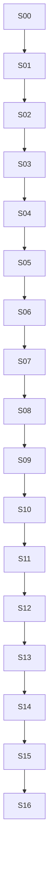

# Plan de implementación del MVP

- **Proyecto:** Knowledge Workflow Engine
- **Documento:** Plan de implementación del MVP
- **Estado:** Accepted
- **Versión:** 1.0
- **Fecha:** 2026-07-24
- **Documentos rectores relacionados:**
  - [`project-scope.md`](project-scope.md)
  - [`architecture.md`](architecture.md)
  - [`tech-stack.md`](tech-stack.md)

## 1. Propósito

Este documento define el orden de construcción del MVP de Knowledge Workflow Engine.

El plan organiza el desarrollo en slices verticales verificables. Cada slice deberá producir una capacidad ejecutable de extremo a extremo y no únicamente componentes técnicos aislados.

El plan establece:

- secuencia de implementación;
- dependencias entre slices;
- entregables;
- pruebas obligatorias;
- criterios de entrada y salida;
- riesgos;
- reglas de integración;
- hitos de validación del MVP.

Este documento no modifica el alcance ni la arquitectura. Cuando una tarea requiera una capacidad fuera de los documentos rectores, deberá detenerse y seguir el proceso de gobierno del alcance.

## 2. Principios de ejecución

1. Cada slice debe entregar comportamiento observable.
2. No se construirán capas completas sin un caso de uso que las atraviese.
3. Se implementará primero el camino más pequeño que valide la arquitectura.
4. Las abstracciones se introducirán cuando exista al menos una implementación real y una necesidad demostrable.
5. Los contratos de extensión deberán existir antes de incorporar la segunda implementación.
6. La persistencia portable y la trazabilidad se incorporarán desde el primer flujo funcional.
7. Las pruebas forman parte del slice, no son una fase posterior.
8. Ningún slice podrá omitir seguridad, validación o manejo de errores aplicable.
9. El árbol Git deberá permanecer limpio al iniciar y finalizar una unidad de trabajo.
10. Cada cambio integrado deberá mantener las validaciones globales aprobadas.
11. Las decisiones diferidas no se implementarán anticipadamente.
12. Una pantalla sin flujo funcional no se considerará avance completo.
13. Un adaptador sin pruebas de contrato no se considerará terminado.
14. Un artefacto no validado no podrá persistirse como exitoso.
15. La interfaz nunca accederá directamente a infraestructura privilegiada.

## 3. Estrategia de ramas e integración

Durante la construcción inicial se utilizará:

- `main` como rama estable;
- ramas cortas por slice o unidad coherente;
- pull requests para cambios funcionales;
- Conventional Commits;
- squash merge recomendado para mantener historial legible.

Convención sugerida:

```text
feat/s01-desktop-bootstrap
feat/s02-project-workspace
feat/s03-text-ingestion
fix/s03-empty-extraction
docs/adr-initial-set
```

Todo pull request deberá indicar:

- slice relacionado;
- alcance;
- criterios de aceptación cubiertos;
- pruebas ejecutadas;
- riesgos o limitaciones;
- archivos de documentación modificados.

## 4. Definition of Ready

Un slice estará listo para comenzar cuando:

- sus dependencias estén completadas;
- el alcance esté respaldado por `project-scope.md`;
- la arquitectura aplicable esté definida;
- las tecnologías estén aprobadas;
- los criterios de salida sean verificables;
- existan fixtures o se haya definido cómo crearlos;
- no haya una decisión bloqueante sin ADR;
- el repositorio esté en estado válido.

## 5. Definition of Done por slice

Cada slice deberá cumplir:

- código implementado;
- tipos estrictos;
- datos externos validados;
- pruebas unitarias;
- pruebas de integración aplicables;
- prueba E2E cuando el flujo sea visible;
- reglas arquitectónicas aprobadas;
- lint, formato y typecheck aprobados;
- errores y estados manejados;
- documentación actualizada;
- fixtures redistribuibles;
- ausencia de secretos;
- build exitoso;
- commit o PR coherente.

Comandos mínimos esperados cuando estén disponibles:

```bash
pnpm lint
pnpm format:check
pnpm typecheck
pnpm check:architecture
pnpm test
pnpm test:integration
pnpm build
```

Los slices de empaquetado deberán ejecutar además:

```bash
pnpm make
```

## 6. Mapa general de slices

| Slice | Capacidad entregada | Dependencia |
|---|---|---|
| S00 | Gobierno documental y ADR iniciales | Documentación rectora |
| S01 | Repositorio ejecutable y ventana segura | S00 |
| S02 | Proyecto local y workspace portable | S01 |
| S03 | Importación y normalización de TXT/Markdown | S02 |
| S04 | Primer resumen con proveedor simulado | S03 |
| S05 | Persistencia, historial y rerenderizado genérico | S04 |
| S06 | Configuración segura y primer proveedor real | S05 |
| S07 | Segundo proveedor y pruebas de contrato | S06 |
| S08 | Múltiples fuentes y contexto consolidado | S07 |
| S09 | PDF, JSON y CSV | S08 |
| S10 | DOCX, PPTX y HTML local | S09 |
| S11 | Fuentes web públicas y protección SSRF | S10 |
| S12 | Renderizadores Notion y Obsidian | S11 |
| S13 | Workflow `knowledge-map` | S12 |
| S14 | Experiencia de escritorio completa | S13 |
| S15 | Cancelación, recuperación y robustez | S14 |
| S16 | Empaquetado Windows y validación del MVP | S15 |

Los slices podrán subdividirse en pull requests pequeños, pero no deberán cambiar su intención funcional.

# 7. S00 — Gobierno documental y decisiones iniciales

## Objetivo

Completar la documentación necesaria para comenzar código con reglas consistentes.

## Alcance

- aprobar documentos rectores;
- crear ADR iniciales;
- crear `AGENTS.md`;
- crear `design-system.md`;
- actualizar README;
- definir plantilla de PR e issues;
- definir política de seguridad básica del repositorio.

## Entregables

```text
README.md
AGENTS.md
docs/project-scope.md
docs/architecture.md
docs/tech-stack.md
docs/implementation-plan.md
docs/design-system.md
docs/adr/0001-use-modular-monolith.md
docs/adr/0002-use-hexagonal-architecture.md
docs/adr/0003-use-neutral-artifacts.md
docs/adr/0004-use-portable-local-workspaces.md
docs/adr/0005-isolate-desktop-ui-from-privileged-operations.md
docs/adr/0006-use-electron-and-typescript.md
docs/adr/0007-use-sqlite-as-rebuildable-local-index.md
docs/adr/0008-use-declarative-versioned-workflows.md
docs/adr/0009-use-zod-as-runtime-schema-source.md
docs/adr/0010-use-provider-adapters.md
```

## Tareas

- revisar consistencia entre documentos;
- eliminar contradicciones;
- definir autoridad documental;
- establecer comandos obligatorios;
- definir reglas para agentes;
- definir principios visuales y componentes mínimos;
- crear templates de GitHub;
- decidir visibilidad final del repositorio durante el MVP;
- documentar política de divulgación de vulnerabilidades.

## Pruebas y validaciones

- enlaces relativos válidos;
- Markdown renderizado correctamente;
- nombres de archivos consistentes;
- ADR con estado, contexto, decisión y consecuencias;
- README alineado con los documentos.

## Criterios de salida

- todos los documentos principales existen;
- las decisiones iniciales están registradas;
- no hay contradicciones conocidas;
- se puede iniciar S01 sin decisiones abiertas de arquitectura o stack.

# 8. S01 — Bootstrap del repositorio y aplicación segura

## Objetivo

Convertir el repositorio documental en un workspace ejecutable con una ventana Electron segura y validaciones automáticas.

## Capacidad demostrable

El desarrollador instala dependencias, ejecuta la aplicación y observa una ventana React. El renderer solo accede a una API limitada expuesta por preload.

## Alcance

- Node 24;
- pnpm workspace;
- TypeScript estricto;
- Electron Forge;
- Vite;
- React;
- Tailwind;
- Vitest;
- ESLint;
- Prettier;
- dependency-cruiser;
- GitHub Actions;
- preload e IPC mínimo;
- utility process de prueba.

## Estructura inicial

```text
apps/desktop/
packages/domain/
packages/application/
packages/contracts/
packages/infrastructure/
packages/workflows/
packages/schemas/
packages/test-support/
workflows/
fixtures/
```

## Tareas

- crear `package.json` raíz;
- crear `pnpm-workspace.yaml`;
- configurar `.npmrc`;
- fijar Node y pnpm;
- configurar tsconfig base;
- inicializar Electron Forge con Vite;
- crear renderer React;
- configurar Tailwind;
- crear preload;
- exponer `app.getVersion`;
- validar respuesta IPC con Zod;
- crear utility process que calcule un hash o transforme texto;
- configurar scripts;
- configurar CI Windows;
- configurar dependency-cruiser;
- agregar tests iniciales.

## Seguridad

- `nodeIntegration: false`;
- `contextIsolation: true`;
- `sandbox: true`;
- CSP restrictiva;
- canales IPC enumerados;
- no cargar contenido remoto;
- bloquear navegación arbitraria.

## Pruebas

- prueba de schema IPC;
- prueba del handler;
- prueba del preload mediante contrato;
- prueba de componente React;
- prueba del utility process;
- prueba que dependency-cruiser detecta dependencia prohibida;
- smoke test de aplicación.

## Criterios de salida

- `pnpm install` funciona desde un clon limpio;
- `pnpm dev` abre la aplicación;
- `pnpm check` pasa;
- CI pasa;
- el renderer no tiene acceso a Node;
- utility process responde correctamente;
- no existe lógica funcional prematura.

# 9. S02 — Proyecto local y workspace portable

## Objetivo

Permitir crear y abrir un proyecto local con estructura determinista y metadatos versionados.

## Capacidad demostrable

El usuario crea un proyecto desde la interfaz, selecciona una carpeta y la aplicación genera un workspace válido. Después puede cerrarlo y volverlo a abrir.

## Alcance

- modelo `Project`;
- `ProjectRepository`;
- `CreateProject`;
- `OpenProject`;
- proyectos recientes;
- estructura de carpetas;
- `project.json`;
- SQLite como índice;
- migración inicial;
- validación de rutas;
- escritura atómica.

## Tareas

- definir schemas de proyecto;
- definir `ProjectId`;
- implementar creador de estructura;
- implementar filesystem seguro;
- crear base SQLite;
- crear tablas iniciales;
- implementar repositorio Drizzle;
- registrar proyecto reciente;
- crear UI de bienvenida;
- crear formulario de proyecto;
- agregar diálogo de selección de carpeta;
- mostrar validaciones y errores;
- implementar reconstrucción mínima del índice.

## Estructura generada

```text
project/
├── project.json
├── sources/files/
├── sources/web/
├── sources/pasted/
├── normalized/
├── runs/
├── artifacts/neutral/summaries/
├── artifacts/neutral/knowledge-graphs/
├── artifacts/notion/pages/
├── artifacts/notion/assets/
├── artifacts/obsidian/notes/
├── artifacts/obsidian/canvas/
├── artifacts/obsidian/attachments/
├── artifacts/generic/markdown/
├── artifacts/generic/json/
├── artifacts/generic/mermaid/
└── logs/
```

## Pruebas

- creación en directorio temporal;
- rechazo de ruta inválida;
- reapertura;
- escritura atómica;
- recuperación de `project.json` corrupto;
- migración de schema;
- reconstrucción del índice;
- E2E de creación y apertura.

## Criterios de salida

- el workspace coincide con el alcance;
- `project.json` está versionado;
- SQLite no es la única fuente de verdad;
- rutas no autorizadas son rechazadas;
- el proyecto puede reconstruirse desde disco.

# 10. S03 — Importación y normalización de TXT y Markdown

## Objetivo

Crear el primer pipeline real de fuente a documento normalizado.

## Capacidad demostrable

El usuario arrastra uno o varios archivos TXT o Markdown, observa su estado y abre una vista previa del contenido normalizado.

## Alcance

- `Source`;
- `RawSource`;
- `ParsedDocument`;
- `NormalizedDocument`;
- `SourceReader`;
- registro de parsers;
- parser TXT;
- parser Markdown;
- detección de tipo;
- detección de idioma;
- cola de importación;
- drag-and-drop;
- selección múltiple;
- errores por archivo.

## Tareas

- definir schemas y entidades;
- implementar lector local;
- copiar snapshot al workspace;
- calcular hash;
- implementar parser de texto;
- implementar parser Markdown;
- crear normalizador;
- integrar `franc-min`;
- guardar documento normalizado;
- indexar en SQLite;
- crear dropzone;
- crear lista de fuentes;
- mostrar idioma, tamaño y estado;
- implementar retry;
- detectar extracción vacía.

## Pruebas

- UTF-8;
- BOM;
- codificación alternativa;
- Markdown con encabezados, código y enlaces;
- archivo vacío;
- extensión engañosa;
- archivo duplicado;
- error parcial en importación múltiple;
- idioma indeterminado;
- E2E de drag-and-drop.

## Criterios de salida

- los workflows futuros pueden consumir `NormalizedDocument`;
- una fuente lista siempre tiene documento válido;
- un archivo defectuoso no cancela los demás;
- el contenido original permanece trazable;
- no existe dependencia de Notion u Obsidian.

# 11. S04 — Primer resumen con proveedor simulado

## Objetivo

Validar el flujo completo desde documento normalizado hasta artefacto neutral, sin depender todavía de credenciales reales.

## Capacidad demostrable

El usuario selecciona un documento, elige `summary`, define idioma y genera un `StudySummary` neutral mediante un proveedor simulado determinista.

## Alcance

- `WorkflowDefinition`;
- registro de workflows;
- TOML;
- prompt Markdown;
- Mustache;
- schema `StudySummary`;
- `WorkflowExecutor`;
- `ModelProvider`;
- proveedor simulado;
- artefacto neutral;
- validación;
- ejecución;
- salida JSON neutral;
- UI mínima de ejecución.

## Tareas

- migrar `summary.toml` a estructura declarativa;
- separar prompt y metadatos;
- eliminar rutas y convenciones de Obsidian;
- definir variables permitidas;
- crear schema Zod;
- generar JSON Schema;
- implementar loader de workflow;
- implementar mock provider;
- crear caso de uso `ExecuteWorkflow`;
- persistir manifiesto de ejecución;
- persistir artefacto neutral;
- mostrar resultado en UI;
- mostrar progreso básico.

## Pruebas

- workflow válido;
- workflow inválido;
- variable faltante;
- respuesta que no cumple schema;
- idioma solicitado;
- prompt injection dentro del documento;
- error del proveedor;
- artefacto persistido;
- trazabilidad completa;
- E2E de resumen simulado.

## Criterios de salida

- existe un `StudySummary` neutral validado;
- el workflow no lee ni escribe archivos;
- el proveedor no contiene estructura de resumen;
- el artefacto referencia ejecución y fuente;
- el resultado puede abrirse sin un gestor de notas.

# 12. S05 — Persistencia, historial y rerenderizado genérico

## Objetivo

Completar el ciclo local con historial y renderizadores genéricos.

## Capacidad demostrable

El usuario consulta una ejecución anterior y genera Markdown o JSON desde el artefacto neutral sin volver a invocar el proveedor.

## Alcance

- historial;
- `ArtifactRepository`;
- `ExecutionRepository`;
- `GenericMarkdownRenderer`;
- `GenericJsonRenderer`;
- rerenderizado;
- manifiesto de renderizado;
- vista previa Markdown;
- logs estructurados.

## Tareas

- completar tablas de ejecución y artefacto;
- implementar repositorios;
- definir estados terminales;
- implementar renderizadores;
- escribir archivos atómicamente;
- crear `RenderExistingArtifact`;
- crear vista de historial;
- crear vista de detalle;
- integrar Pino;
- redacción de secretos;
- generar correlación por ejecución.

## Pruebas

- renderizado determinista;
- rerenderizado sin provider;
- artefacto inexistente;
- escritura fallida;
- historial ordenado;
- reconstrucción desde manifiestos;
- logs sin contenido sensible;
- E2E de rerenderizado.

## Criterios de salida

- cambiar el formato no genera una nueva llamada de IA;
- los archivos aparecen bajo `artifacts/generic`;
- los estados terminales son inmutables;
- SQLite puede reconstruirse;
- el usuario puede abrir el resultado.

# 13. S06 — Configuración segura y primer proveedor real

## Objetivo

Conectar Gemini como primer proveedor real manteniendo aislamiento de credenciales y contrato común.

## Capacidad demostrable

El usuario configura una API key, valida un modelo y genera un resumen real. El renderer nunca recibe la clave.

## Alcance

- `SecretStore`;
- `safeStorage`;
- configuración de proveedor;
- `GeminiProvider`;
- selección de modelo;
- capacidades;
- timeout;
- cancelación;
- uso reportado;
- errores normalizados.

## Tareas

- crear schemas de configuración;
- implementar secret store;
- almacenar referencias en SQLite;
- crear UI de configuración;
- implementar estado configurado/no configurado;
- implementar adaptador `@google/genai`;
- traducir schemas;
- validar respuesta localmente;
- mapear errores;
- ocultar claves;
- agregar prueba manual opt-in.

## Pruebas

- clave ausente;
- clave inválida mediante mock;
- timeout;
- cancelación;
- respuesta inválida;
- error del SDK;
- uso reportado;
- secreto no visible por IPC;
- logs redactados;
- contrato del provider.

## Criterios de salida

- Gemini ejecuta el mismo workflow sin modificarlo;
- la clave no aparece en renderer, SQLite, logs o manifiestos;
- fallos externos producen códigos internos;
- el proveedor declara capacidades.

# 14. S07 — Segundo proveedor y pruebas de sustitución

## Objetivo

Demostrar agnosticidad real mediante OpenAI.

## Capacidad demostrable

El usuario ejecuta `summary` con Gemini u OpenAI desde la misma pantalla y definición de workflow.

## Alcance

- `OpenAIProvider`;
- selector de proveedor;
- configuración por proveedor;
- negociación de capacidades;
- suite común de contrato;
- comparación de trazabilidad.

## Tareas

- implementar SDK oficial;
- adaptar JSON Schema soportado;
- validar localmente;
- agregar configuración;
- reutilizar secret store;
- ejecutar suite común;
- impedir dependencias del workflow a proveedor;
- registrar provider/model en ejecución.

## Pruebas

- mismas pruebas de contrato que Gemini;
- selección de modelo;
- proveedor no configurado;
- schema parcialmente soportado;
- respuesta inválida;
- verificación arquitectónica;
- E2E con proveedores simulados intercambiables.

## Criterios de salida

- dos proveedores pasan la misma suite;
- ningún archivo de workflow contiene un provider ID obligatorio;
- cambiar de proveedor no modifica el schema neutral;
- la trazabilidad registra proveedor y modelo.

# 15. S08 — Múltiples fuentes y planificación de contexto

## Objetivo

Permitir resúmenes consolidados de varias fuentes con procedencia y límites explícitos.

## Capacidad demostrable

El usuario selecciona varios documentos y obtiene un resumen consolidado. Las fuentes omitidas o truncadas se muestran claramente.

## Alcance

- selección múltiple;
- `ContextPlanner`;
- medición aproximada;
- orden determinista;
- segmentación por encabezados;
- límites;
- consolidación;
- procedencia;
- estado parcial.

## Tareas

- definir política de contexto;
- crear modelo de fragmentos;
- preservar `SourceId`;
- implementar segmentación;
- implementar límites por fuente;
- implementar estrategia map/reduce determinista cuando sea necesaria;
- agregar advertencias;
- mostrar fuentes incluidas y excluidas;
- finalizar como `completed_with_errors` cuando corresponda.

## Pruebas

- varias fuentes pequeñas;
- mezcla de idiomas;
- una fuente inválida;
- límite excedido;
- segmentación;
- orden estable;
- cancelación entre etapas;
- procedencia en resultado;
- ausencia de RAG o embeddings.

## Criterios de salida

- el resultado identifica fuentes utilizadas;
- no se ocultan truncamientos;
- una fuente fallida no cancela las válidas;
- el planificador no depende de un proveedor concreto.

# 16. S09 — PDF, JSON y CSV

## Objetivo

Ampliar el pipeline con tres formatos adicionales y validar el contrato de parsers.

## Capacidad demostrable

El usuario importa PDF con texto, JSON y CSV; cada uno produce un documento normalizado y puede resumirse.

## Alcance

- `pdfjs-dist`;
- JSON;
- `csv-parse`;
- registro de parsers;
- utility processes;
- fixtures;
- advertencias.

## Tareas

- implementar parser PDF;
- extraer páginas y metadatos;
- detectar PDF vacío o escaneado;
- implementar parser JSON;
- implementar representación estable;
- implementar parser CSV;
- limitar filas y columnas;
- mover parsing pesado a utility process;
- crear suite común de parser.

## Pruebas

- PDF con texto;
- PDF sin texto;
- PDF corrupto;
- JSON válido e inválido;
- JSON grande;
- CSV con distintos delimitadores;
- CSV con errores;
- cancelación;
- parser equivocado;
- integración de múltiples formatos.

## Criterios de salida

- los tres parsers cumplen el mismo contrato;
- PDF escaneado se rechaza explícitamente;
- no existe OCR;
- la UI permanece responsiva.

# 17. S10 — DOCX, PPTX y HTML local

## Objetivo

Completar los formatos documentales locales del alcance.

## Capacidad demostrable

DOCX, PPTX y HTML local se importan y normalizan con advertencias sobre limitaciones visuales.

## Alcance

- Mammoth;
- Open XML;
- ZIP;
- XML;
- jsdom;
- Readability;
- DOMPurify;
- metadatos;
- notas de PowerPoint.

## Tareas

- implementar parser DOCX;
- sanitizar HTML intermedio;
- implementar parser PPTX mínimo;
- resolver orden de diapositivas;
- extraer notas;
- implementar parser HTML;
- extraer contenido principal;
- normalizar estructura;
- incorporar fixtures maliciosos.

## Pruebas

- DOCX con encabezados y tabla;
- DOCX corrupto;
- PPTX con varias diapositivas;
- notas;
- SmartArt no interpretado;
- HTML con scripts;
- HTML sin contenido principal;
- sanitización;
- cancelación;
- error parcial.

## Criterios de salida

- los tres formatos producen documentos normalizados;
- no se ejecuta contenido activo;
- las limitaciones se muestran;
- el parser PPTX permanece reemplazable.

# 18. S11 — Fuentes web públicas

## Objetivo

Permitir importar contenido desde URL pública con controles de seguridad.

## Capacidad demostrable

El usuario ingresa una URL pública y obtiene una fuente normalizada o un error accionable.

## Alcance

- formulario URL;
- `WebFetcher`;
- HTTP/HTTPS;
- DNS;
- protección SSRF;
- redirecciones;
- límites;
- HTML;
- PDF directo;
- snapshot;
- fecha de recuperación.

## Tareas

- validar URL;
- resolver DNS;
- bloquear rangos privados;
- controlar puertos;
- controlar redirecciones;
- limitar tamaño;
- aplicar timeout;
- detectar content type;
- usar parser HTML o PDF;
- guardar snapshot y metadatos;
- mostrar errores de red;
- crear MSW fixtures.

## Pruebas

- HTML público;
- PDF público simulado;
- redirección válida;
- redirección a localhost;
- IP privada;
- DNS que cambia;
- esquema no permitido;
- timeout;
- contenido excesivo;
- content type inesperado;
- página vacía.

## Criterios de salida

- no existe navegador automatizado;
- cada redirección se revalida;
- la URL original y fecha se registran;
- contenido web se trata como no confiable;
- una URL puede alimentar ambos workflows.

# 19. S12 — Renderizadores para Notion y Obsidian

## Objetivo

Demostrar independencia del gestor de notas mediante salidas específicas derivadas del mismo artefacto neutral.

## Capacidad demostrable

Un `StudySummary` existente se renderiza para Notion, Obsidian y formato genérico sin llamar al modelo.

## Alcance

- `NotionMarkdownRenderer`;
- `ObsidianMarkdownRenderer`;
- frontmatter YAML;
- wikilinks;
- manifiestos;
- rutas estandarizadas;
- assets;
- pruebas snapshot.

## Tareas

- definir contextos de renderizado;
- implementar nombres deterministas;
- implementar Markdown Notion;
- implementar Mermaid embebible cuando corresponda;
- implementar Markdown Obsidian;
- implementar frontmatter;
- resolver enlaces relativos;
- generar manifiestos;
- mostrar destinos en UI;
- permitir múltiples destinos.

## Pruebas

- mismo artefacto, tres destinos;
- caracteres especiales;
- nombres duplicados;
- rutas seguras;
- frontmatter válido;
- Markdown estable;
- rerenderizado;
- fallo de un destino con éxito de otros.

## Criterios de salida

- Notion se guarda bajo `artifacts/notion`;
- Obsidian se guarda bajo `artifacts/obsidian`;
- no existe API remota de Notion;
- el workflow desconoce ambos destinos;
- fallo parcial produce estado coherente.

# 20. S13 — Workflow `knowledge-map`

## Objetivo

Implementar el segundo y último workflow del MVP.

## Capacidad demostrable

El usuario genera un `KnowledgeGraph` neutral y lo renderiza como Mermaid y JSON Canvas.

## Alcance

- migración de `generate.toml`;
- schema `KnowledgeGraph`;
- nodos;
- relaciones;
- referencias;
- `MermaidRenderer`;
- `JsonCanvasRenderer`;
- layout determinista básico.

## Tareas

- separar prompt de convenciones Obsidian;
- definir schema de grafo;
- definir identificadores;
- validar nodos y edges;
- implementar serializador Mermaid;
- implementar JSON Canvas;
- crear layout básico;
- agregar preview;
- manejar límites de nodos.

## Pruebas

- grafo simple;
- nodos duplicados;
- edge huérfano;
- etiquetas especiales;
- layout determinista;
- JSON Canvas válido;
- Mermaid escapado;
- fuente multilingüe;
- múltiples fuentes;
- rerenderizado sin IA.

## Criterios de salida

- el grafo neutral no contiene coordenadas obligatorias;
- Mermaid y Canvas parten del mismo artefacto;
- Obsidian links se agregan solo en renderer;
- no se incorporan workflows adicionales.

# 21. S14 — Experiencia de escritorio completa

## Objetivo

Consolidar una interfaz técnica inspirada en OpenCode y alineada con el sistema de diseño.

## Capacidad demostrable

El usuario completa todos los flujos principales sin utilizar archivos o comandos manuales.

## Alcance

- AppShell;
- sidebar;
- proyectos;
- fuentes;
- historial;
- command panel;
- selectores;
- consola de ejecución;
- vista previa;
- status bar;
- atajos;
- accesibilidad;
- modo oscuro.

## Tareas

- implementar tokens;
- crear componentes mínimos;
- navegación;
- estados vacíos;
- estados de carga;
- errores accionables;
- resize de paneles;
- accesibilidad por teclado;
- focus management;
- anuncios de progreso;
- abrir carpetas y archivos;
- pulir drag-and-drop múltiple.

## Pruebas

- navegación por teclado;
- formularios;
- dropzone;
- lectores de pantalla en elementos críticos;
- estados vacíos;
- errores;
- proyecto con muchas fuentes;
- historial;
- preview;
- E2E del flujo completo.

## Criterios de salida

- todos los casos de uso principales son accesibles desde UI;
- no se requiere editar configuración manualmente;
- los errores explican la acción siguiente;
- la densidad no sacrifica legibilidad.

# 22. S15 — Cancelación, recuperación y robustez

## Objetivo

Endurecer la aplicación frente a fallos, cancelaciones, archivos problemáticos y estados inconsistentes.

## Capacidad demostrable

El usuario cancela una ejecución, reintenta una fuente y abre un proyecto después de una interrupción sin perder integridad.

## Alcance

- propagación de `AbortSignal`;
- colas;
- límites;
- recovery;
- reparación del índice;
- escrituras atómicas;
- corrupción parcial;
- códigos de error;
- logs;
- pruebas de estrés moderado.

## Tareas

- implementar cancelación completa;
- distinguir estados;
- impedir doble escritura;
- completar códigos de error;
- probar cierre durante operación;
- reparar índice;
- manejar manifiesto incompleto;
- limpiar temporales;
- aplicar límites configurables;
- generar diagnóstico exportable sin secretos.

## Pruebas

- cancelar parser;
- cancelar provider;
- cancelar renderizado;
- cerrar aplicación;
- archivo bloqueado;
- disco sin espacio simulado;
- SQLite corrupto;
- manifiesto parcial;
- múltiples tareas;
- logs redactados;
- proyecto grande dentro de límites.

## Criterios de salida

- no hay artefactos incompletos marcados como válidos;
- estados terminales son inmutables;
- recuperación es documentada;
- errores parciales son trazables;
- la interfaz permanece operativa.

# 23. S16 — Empaquetado Windows y validación final

## Objetivo

Producir un instalador Windows y demostrar todos los criterios de aceptación del MVP.

## Capacidad demostrable

Un usuario instala la aplicación en un entorno limpio, crea un proyecto y ejecuta los dos workflows con los destinos aprobados.

## Alcance

- Electron Forge;
- Squirrel.Windows;
- ASAR;
- fuses;
- módulos nativos;
- build reproducible;
- smoke test;
- checklist del MVP;
- release candidate;
- actualización del README.

## Tareas

- configurar maker;
- configurar rebuild;
- revisar contenido del paquete;
- excluir archivos innecesarios;
- generar checksum;
- probar instalación y desinstalación;
- validar safeStorage;
- validar rutas con espacios;
- ejecutar matriz de aceptación;
- documentar limitaciones;
- crear notas de release;
- marcar versión pre-1.0.

## Pruebas

- build limpio;
- instalador x64;
- apertura en Windows 10/11 disponible;
- creación de proyecto;
- importación de todos los formatos;
- URL;
- dos proveedores;
- dos workflows;
- tres destinos;
- cancelación;
- historial;
- reconstrucción de índice;
- ausencia de secretos;
- smoke E2E empaquetado.

## Criterios de salida

- los veinte criterios de aceptación de `project-scope.md` están demostrados;
- existe instalador;
- README permite construir desde cero;
- no hay errores bloqueantes;
- documentación actualizada;
- limitaciones conocidas registradas;
- release candidate etiquetada.

# 24. Hitos de producto

## Hito A — Esqueleto confiable

Incluye:

- S00;
- S01;
- S02.

Demuestra:

- gobierno;
- seguridad de escritorio;
- workspace portable;
- persistencia inicial.

## Hito B — Primer flujo completo

Incluye:

- S03;
- S04;
- S05.

Demuestra:

- documento normalizado;
- workflow;
- artefacto neutral;
- renderizado genérico;
- historial.

## Hito C — Agnosticidad del proveedor

Incluye:

- S06;
- S07.

Demuestra:

- secretos;
- Gemini;
- OpenAI;
- contrato común.

## Hito D — Cobertura documental

Incluye:

- S08;
- S09;
- S10;
- S11.

Demuestra:

- múltiples fuentes;
- formatos;
- URL pública;
- contexto consolidado.

## Hito E — Agnosticidad del gestor

Incluye:

- S12;
- S13.

Demuestra:

- Notion;
- Obsidian;
- Mermaid;
- JSON Canvas;
- dos workflows.

## Hito F — Release candidate

Incluye:

- S14;
- S15;
- S16.

Demuestra:

- experiencia completa;
- robustez;
- instalador;
- aceptación final.

# 25. Matriz de criterios de aceptación

| Criterio del alcance | Slice principal |
|---|---|
| Crear y abrir proyecto | S02 |
| Drag-and-drop múltiple | S03 |
| Texto pegado y URL | S03, S11 |
| Formatos compatibles | S03, S09, S10 |
| Documento normalizado | S03 |
| Idioma detectado | S03 |
| Idioma de salida | S04 |
| Resumen individual y consolidado | S04, S08 |
| Knowledge map | S13 |
| Dos proveedores | S07 |
| Artefacto neutral | S04 |
| Notion, Obsidian y genérico | S12, S13 |
| Rerenderizado sin IA | S05, S12 |
| Carpetas estandarizadas | S02, S12 |
| Markdown y JSON Canvas | S12, S13 |
| Markdown Notion y Mermaid | S12, S13 |
| Fallos parciales | S03, S08, S15 |
| Historial | S05 |
| Credenciales protegidas | S06 |
| Instalador Windows | S16 |

# 26. Dependencias críticas



Se mantiene una secuencia principal para reducir integración paralela prematura.

Algunas tareas internas podrán ejecutarse en paralelo cuando no compartan contratos inestables, por ejemplo:

- fixtures;
- componentes visuales aislados;
- documentación;
- pruebas de parsers ya definidos.

# 27. Riesgos de implementación

| Riesgo | Slice afectado | Mitigación |
|---|---|---|
| Incompatibilidad de módulo nativo | S01, S02, S16 | Forge rebuild y CI Windows |
| IPC demasiado amplio | S01 | API enumerada y schemas |
| Workspace e índice divergentes | S02, S05 | reconstrucción y manifiestos |
| Prompt acoplado a Obsidian | S04, S13 | migración a artefacto neutral |
| Respuesta inválida de proveedor | S06, S07 | validación local |
| Diferencia de capacidades | S07 | negociación explícita |
| Contexto demasiado grande | S08 | límites y segmentación |
| PDF/PPTX imperfectos | S09, S10 | advertencias y contrato reemplazable |
| SSRF | S11 | guard de red y pruebas |
| Rutas inseguras | S02, S12 | canonicalización y autorización |
| Canvas ilegible | S13 | layout básico determinista |
| UI bloqueada | S09, S10 | utility processes |
| Cancelación inconsistente | S15 | propagación sistemática |
| Paquete Windows incompleto | S16 | smoke test desde entorno limpio |

# 28. Backlog explícitamente pospuesto

No se incorporará durante estos slices:

- OCR;
- procesamiento visual de imágenes;
- audio o video;
- XLSX completo;
- API remota de Notion;
- sincronización;
- navegador automatizado;
- RAG;
- embeddings;
- base vectorial;
- chat global;
- colaboración;
- nube;
- plugins;
- auto-update;
- macOS y Linux oficiales;
- workflows adicionales.

Una solicitud relacionada deberá registrarse como backlog posterior al MVP, no mezclarse con el slice activo.

# 29. Seguimiento del progreso

Cada slice tendrá un checklist en GitHub issue o project board.

Campos recomendados:

- estado;
- owner;
- dependencia;
- criterios de salida;
- PR relacionados;
- pruebas;
- riesgos;
- documentación;
- decisión pendiente.

Estados:

```text
Backlog
Ready
In Progress
In Review
Blocked
Done
```

El porcentaje de tareas no sustituye la validación de capacidad.

Un slice solo cambia a `Done` cuando cumple sus criterios de salida.

# 30. Política de cambios al plan

Se podrá modificar el orden cuando:

- una dependencia técnica real lo exija;
- un riesgo necesite validación temprana;
- una decisión de arquitectura cambie;
- un criterio de aceptación no pueda demostrarse en la secuencia prevista.

Todo cambio deberá:

1. explicar la causa;
2. mantener cobertura de alcance;
3. actualizar dependencias;
4. identificar riesgos;
5. actualizar este documento;
6. registrar ADR cuando corresponda.

# 31. Primera unidad de desarrollo después de la documentación

Después de completar `AGENTS.md`, `design-system.md`, README y ADR iniciales, la primera unidad de código será:

```text
S01 — Bootstrap del repositorio y aplicación segura
```

El primer PR de implementación no deberá incluir todavía:

- SQLite funcional;
- parsers;
- proveedores;
- workflows reales;
- renderizadores;
- pantallas completas.

Su propósito será establecer un esqueleto seguro, ejecutable y verificable.

# 32. Próximo documento

Una vez aceptado este plan, el siguiente documento rector será:

```text
AGENTS.md
```

Ese documento convertirá alcance, arquitectura, stack y plan en instrucciones operativas obligatorias para personas y agentes de inteligencia artificial que modifiquen el repositorio.
